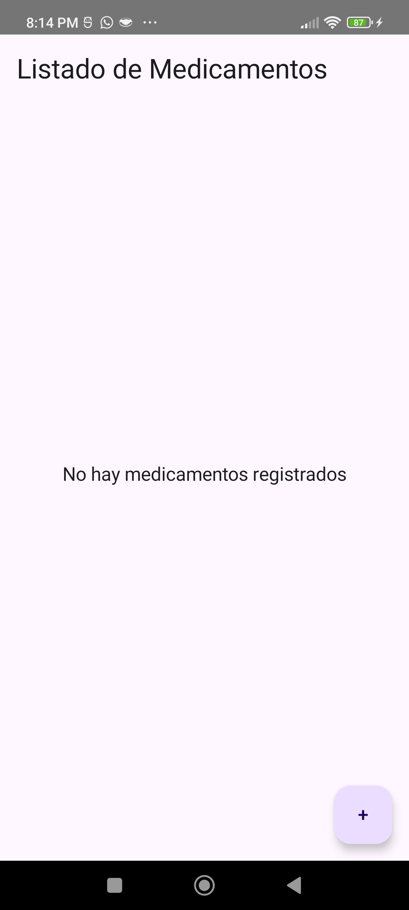
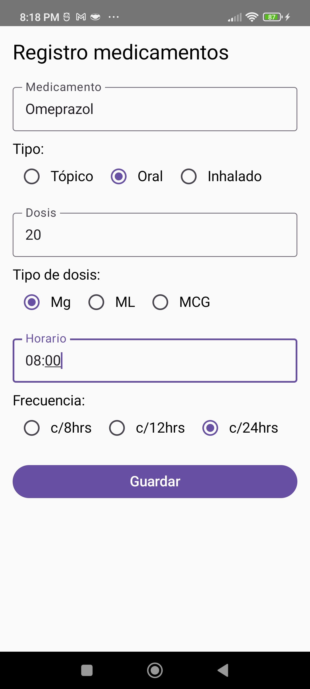
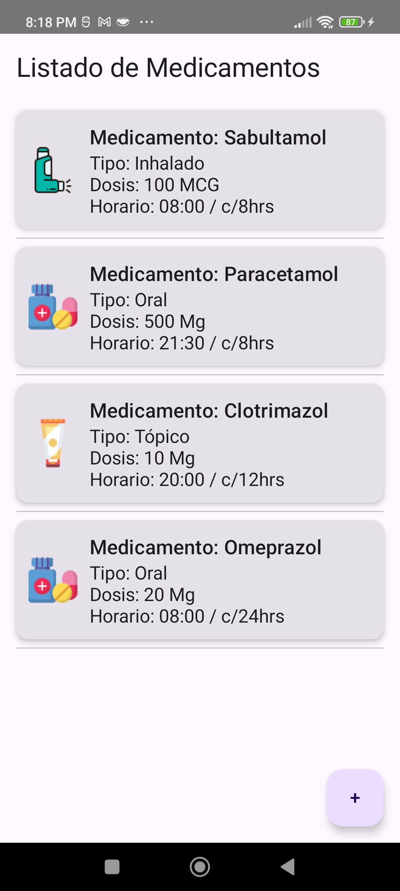

# 💊 Control de Medicamentos App

Aplicación móvil desarrollada en Kotlin con Jetpack Compose que permite a los usuarios **registrar y controlar el consumo de medicamentos** de manera eficiente. Ideal para personas que deben seguir tratamientos con múltiples dosis, tipos y horarios.

---

## 📱 Capturas de Pantalla
### (Home) Lista Vacía


### Registro Medicamentos


### Lista Con Registros



<!--


-->

---

## 🛠 Tecnologías Usadas

- **Kotlin**
- **Jetpack Compose** (UI moderna)
- **Room** (persistencia de datos con SQLite)
- **ViewModel + StateFlow** (gestión de estado)
- **Navigation Compose** (navegación entre pantallas)
- **Coroutines** (hilos seguros y eficientes)
- **Internacionalización** (`values/strings.xml` y `values-es/`)

---

## 🧩 Características

- ✅ Registro de medicamentos con:
  - Medicamento (texto)
  - Tipo (oral, tópico, inhalado)
  - Dosis y tipo de dosis (mg, pastillas, ml)
  - Horario y frecuencia (c/6hrs, c/8hrs, etc.)
- ✅ Listado dinámico con íconos representativos según tipo
- ✅ Navegación entre listado y formulario
- ✅ Datos persistentes (se mantienen al cerrar la app)
- ✅ Soporte para español e inglés
- ✅ Validación de campos antes de guardar

---

## 📁 Estructura del Proyecto

├── data/

│   ├── Medicamento.kt

│   ├── MedicamentoDao.kt

│   └── AppDatabase.kt

├── ui/

│   └── screens/

│       ├── MedicamentoListScreen.kt

│       └── MedicamentoFormScreen.kt

├── viewmodel/

│   └── MedicamentoViewModel.kt

├── components/

│   └── MedicamentoItem.kt

│   └── DropdownSelector.kt

├── res/

│   ├── drawable/

│   ├── values/strings.xml

│   └── values-es/strings.xml


---

## 🚀 Cómo ejecutar el proyecto

1. Clona el repositorio:
   ```bash
   git clone [https:](https://github.com/JAlexCastro/control-medicamentos-app.git)
   '''

1. Abre el proyecto en Android Studio.
2. Asegúrate de tener:
    - SDK mínimo 24
    - Kotlin 1.9+
    - Android Studio Giraffe o posterior
3. Ejecuta en un emulador o dispositivo físico.

---

## 🔒 Room: Migración de esquema

Si cambias la entidad Medicamento (agregas, quitas o editas campos), aumenta la versión en AppDatabase.kt:

```kotlin
@Database(entities = [Medicamento::class], version = 4)
```
Y durante el desarrollo puedes usar:
```kotlin
.fallbackToDestructiveMigration()
```
Esto borra y recrea la base de datos automáticamente si hay cambios de versión.

---

## 🌱 Mejoras futuras

- [ ]  Edición y eliminación de medicamentos
- [ ]  Notificaciones para recordar horarios
- [ ]  Operaciones CRUD
- [ ]  Dark mode

---

## ✍ Autor

**José Alejandro Contreras**

Apasionado por la ingeniería de datos y el desarrollo de software.

[LinkedIn: José Alejandro Castro](https://www.linkedin.com/in/alejandro-castro-a173a0221)

